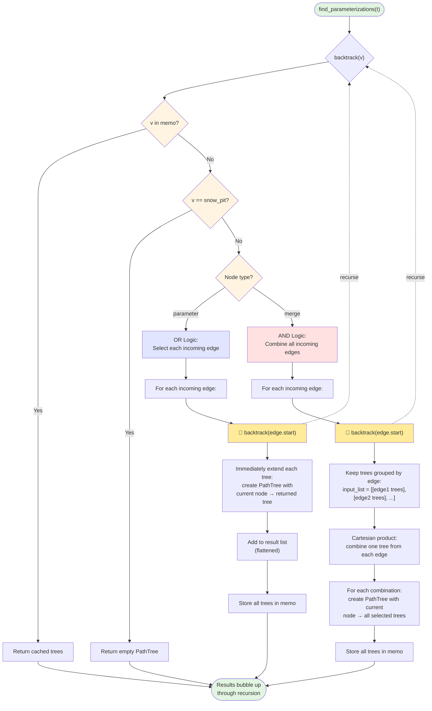

# Parameterization Algorithm Flowchart

This flowchart shows the key recursive and memoization logic in `parameterization_algorithm.py`.

## Key Components

### 1. Memoization Strategy
- **Cache**: `memo: Dict[Node, List[PathTree]]`
- **Purpose**: Avoid recomputing path trees for nodes visited multiple times
- **Check**: First operation in `backtrack()` checks if node is in memo

### 2. Base Case
- **Condition**: `node == snow_pit`
- **Action**: Return PathTree with empty branches (leaf node)

### 3. Parameter Node (OR Logic)
- **Behavior**: Each incoming edge represents an alternative way to compute the parameter
- **Process**: 
  1. Loop through each incoming edge independently
  2. Recursively get trees from the edge's source node (predecessor)
  3. For each returned tree, create a new PathTree with:
     - Current node as the root
     - The returned tree as a child branch
  4. Collect all new trees from all edges
- **Example**: If we're at node `X` and get back a tree `snow_pit→A→B`, we create `snow_pit→A→B→X`

### 4. Merge Node (AND Logic)
- **Behavior**: All incoming edges must be included (all inputs are required)
- **Process**:
  1. For each incoming edge, recursively get trees from the edge's source node
  2. Collect results into a list of lists: `[[trees from input1], [trees from input2], ...]`
  3. Compute Cartesian product: pick one tree from each input
  4. For each combination, create a new PathTree with:
     - Current node as the root
     - All selected trees as child branches
- **Example**: 
  - Input A returns 2 trees: `[tree_A1, tree_A2]`
  - Input B returns 3 trees: `[tree_B1, tree_B2, tree_B3]`
  - Cartesian product gives 6 combinations: `(A1,B1), (A1,B2), (A1,B3), (A2,B1), (A2,B2), (A2,B3)`
  - Each combination becomes a merged PathTree with current node having both inputs as branches

### 5. Recursion Flow
- **Initial call**: `find_parameterizations()` calls `backtrack(target_parameter)`
- **Recursive calls**: Each `backtrack(node)` may call `backtrack()` on predecessor nodes
- **Return path**: 
  - When `backtrack()` returns to another `backtrack()` call (recursive case), the returned trees are used to construct the caller's trees
  - When `backtrack()` returns to `find_parameterizations()` (base of call stack), the recursion is complete
- **Direction**: Works backward from target parameter to snow_pit
- **Memoization**: Prevents redundant computation when the same node is reached via different paths
- **Result**: Returns list of all possible path trees from the given node to snow_pit

## Complexity Notes

- **Memoization**: Each node computed at most once
- **Cartesian Product**: For merge nodes with n inputs, if each has m trees, produces m^n combinations
- **Result**: All possible parameterizations are enumerated

