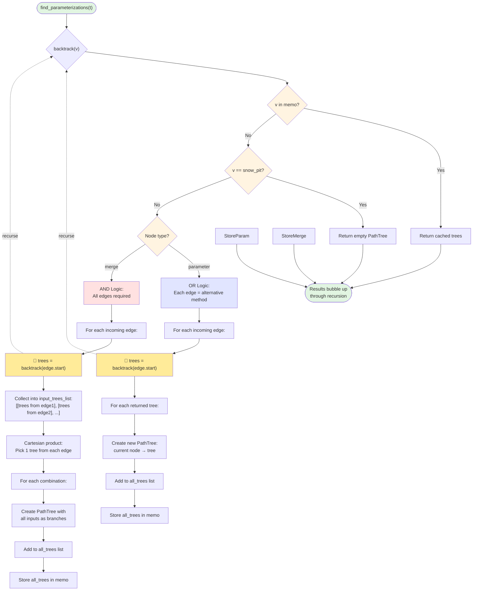

# Parameterization Algorithm Flowchart

This flowchart shows the key recursive and memoization logic in `parameterization_algorithm.py`.

## Key Components

### 1. Memoization Strategy
- **Cache**: `memo: Dict[Node, List[PathTree]]`
- **Purpose**: Avoid recomputing path trees for nodes visited multiple times
- **Check**: First operation in `backtrack()` checks if node is in memo

### 2. Base Case
- **Condition**: `node == snow_pit`
- **Action**: Return PathTree with empty branches (leaf node)

### 3. Parameter Node (OR Logic)
- **Meaning**: Each incoming edge represents a different method to calculate this parameter
- **Example**: If parameter `X` can be calculated by method A OR method B, we explore both
- **Process**: 
  1. For each incoming edge (method):
     - Recursively get all path trees from the predecessor node
     - For each returned tree, wrap it by creating a new PathTree with current node on top
     - Add all wrapped trees to the result list
- **Result**: If edge1 returns 3 trees and edge2 returns 2 trees, we get 5 total trees (3+2)

### 4. Merge Node (AND Logic)
- **Meaning**: All incoming edges must be included (all inputs are required)
- **Example**: If merge node needs input A AND input B, we must have paths for both
- **Process**:
  1. For each incoming edge:
     - Recursively get all path trees from the predecessor node
     - Store in input_trees_list: `[[trees from A], [trees from B], ...]`
  2. Compute Cartesian product: pick one tree from each input
  3. For each combination, create a PathTree with all inputs as branches
- **Result**: If input A has 2 trees and input B has 3 trees, we get 6 combinations (2×3)
- **Why Cartesian?**: Every way to reach A must be paired with every way to reach B

### 5. Recursion Flow
- **Initial call**: `find_parameterizations()` calls `backtrack(target_parameter)`
- **Recursive calls**: Each `backtrack(node)` may call `backtrack()` on predecessor nodes
- **Return path**: 
  - When `backtrack()` returns to another `backtrack()` call (recursive case), the returned trees are used to construct the caller's trees
  - When `backtrack()` returns to `find_parameterizations()` (base of call stack), the recursion is complete
- **Direction**: Works backward from target parameter to snow_pit
- **Memoization**: Prevents redundant computation when the same node is reached via different paths
- **Result**: Returns list of all possible path trees from the given node to snow_pit

## Complexity Notes

- **Memoization**: Each node computed at most once
- **Cartesian Product**: For merge nodes with n inputs, if each has m trees, produces m^n combinations
- **Result**: All possible parameterizations are enumerated

