# Parameterization Algorithm Flowchart

This flowchart shows the key recursive and memoization logic in `parameterization_algorithm.py`.

```mermaid
flowchart TD
    Start(["find_parameterizations(t)"]) --> Backtrack{"backtrack(v)"}
    
    Backtrack --> CheckMemo{v in memo?}
    CheckMemo -->|Yes| Return[Return cached trees]
    CheckMemo -->|No| CheckBase{v == snow_pit?}
    
    CheckBase -->|Yes| BaseCase[Return empty PathTree]
    CheckBase -->|No| CheckType{Node type?}
    
    CheckType -->|parameter| ParamLogic["OR Logic:<br/>Try each incoming edge"]
    CheckType -->|merge| MergeLogic["AND Logic:<br/>Combine all incoming edges"]
    
    ParamLogic --> RecurseParam["🔄 backtrack(predecessor)"]
    RecurseParam -.->|recurse| Backtrack
    RecurseParam --> BuildParam[Build PathTree for each result]
    BuildParam --> StoreParam[Store in memo & return]
    
    MergeLogic --> RecurseMerge["🔄 backtrack(each predecessor)"]
    RecurseMerge -.->|recurse| Backtrack
    RecurseMerge --> Cartesian[Cartesian product of results]
    Cartesian --> BuildMerge[Build PathTree for each combination]
    BuildMerge --> StoreMerge[Store in memo & return]
    
    StoreParam --> End
    StoreMerge --> End
    BaseCase --> End
    Return --> End
    End([Results bubble up<br/>through recursion])
    
    style Start fill:#e1f5e1
    style End fill:#e1f5e1
    style CheckMemo fill:#fff4e1
    style CheckBase fill:#fff4e1
    style CheckType fill:#fff4e1
    style ParamLogic fill:#e1e5ff
    style MergeLogic fill:#ffe1e1
    style RecurseParam fill:#ffeb99
    style RecurseMerge fill:#ffeb99
```

## Key Components

### 1. Memoization Strategy
- **Cache**: `memo: Dict[Node, List[PathTree]]`
- **Purpose**: Avoid recomputing path trees for nodes visited multiple times
- **Check**: First operation in `backtrack()` checks if node is in memo

### 2. Base Case
- **Condition**: `node == snow_pit`
- **Action**: Return PathTree with empty branches (leaf node)

### 3. Parameter Node (OR Logic)
- **Behavior**: Each incoming edge represents an alternative way to compute the parameter
- **Process**: 
  1. Loop through each incoming edge independently
  2. Recursively get trees from edge source
  3. Create new tree for each source tree
  4. Collect all possibilities

### 4. Merge Node (AND Logic)
- **Behavior**: All incoming edges must be included
- **Process**:
  1. Get trees for each input edge
  2. Compute Cartesian product of all input tree lists
  3. Create tree for each combination
  4. Each combination represents one valid way to satisfy all merge inputs

### 5. Recursion Flow
- **Initial call**: `find_parameterizations()` calls `backtrack(target_parameter)`
- **Recursive calls**: Each `backtrack(node)` may call `backtrack()` on predecessor nodes
- **Return path**: 
  - When `backtrack()` returns to another `backtrack()` call (recursive case), the returned trees are used to construct the caller's trees
  - When `backtrack()` returns to `find_parameterizations()` (base of call stack), the recursion is complete
- **Direction**: Works backward from target parameter to snow_pit
- **Memoization**: Prevents redundant computation when the same node is reached via different paths
- **Result**: Returns list of all possible path trees from the given node to snow_pit

## Complexity Notes

- **Memoization**: Each node computed at most once
- **Cartesian Product**: For merge nodes with n inputs, if each has m trees, produces m^n combinations
- **Result**: All possible parameterizations are enumerated

