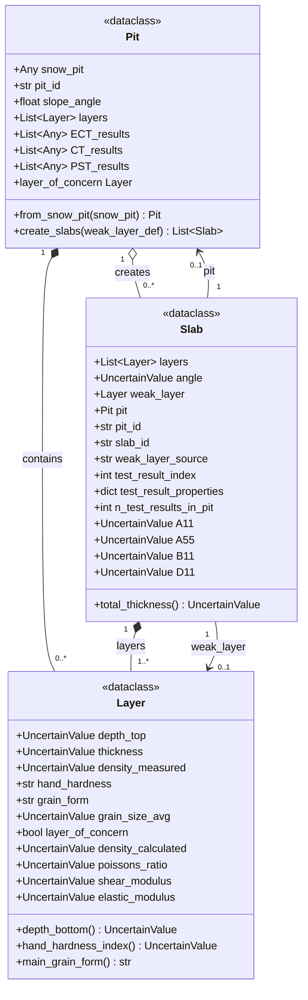

# Data Structures UML Diagram

Mermaid UML diagram of the snow mechanical parameter data structures: `Layer`, `Pit`, and `Slab`.

## Relationships

| Relationship | Description |
|--------------|-------------|
| **Pit → Layer** | A `Pit` contains a list of `Layer` objects (composition). Layers are created from the snow profile via `_create_layers_from_profile()`. |
| **Pit → Slab** | A `Pit` creates one or more `Slab` objects via `create_slabs()`. Each slab corresponds to a weak layer identified by a test result or layer of concern. |
| **Slab → Layer** | A `Slab` contains an ordered list of `Layer` objects (the slab layers above the weak layer). |
| **Slab → weak_layer** | A `Slab` references a single `Layer` as its weak layer. |
| **Slab → Pit** | A `Slab` holds a reference back to its parent `Pit` for accessing test results and metadata. |

## Type Aliases

- **UncertainValue**: `Union[float, uncertainties.UFloat]` — values that can be regular floats or uncertain numbers for error propagation.
