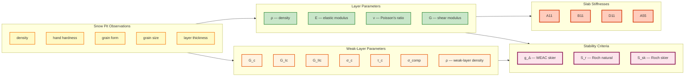

# SnowPyt-MechParams — Overview

```mermaid
graph LR

    subgraph INPUTS[Snow Pit Observations]
        meas_density[density]
        meas_hh[hand hardness]
        meas_gf[grain form]
        meas_gs[grain size]
        meas_thick[layer thickness]
    end

    subgraph LAYER[Layer Parameters]
        rho[ρ — density]
        E[E — elastic modulus]
        nu[ν — Poisson's ratio]
        G[G — shear modulus]
    end

    subgraph SLAB[Slab Stiffnesses]
        A11[A11]
        B11[B11]
        D11[D11]
        A55[A55]
    end

    subgraph WEAKLAYER[Weak-Layer Parameters]
        Gc[G_c]
        GIc[G_Ic]
        GIIc[G_IIc]
        sigmac[σ_c]
        tauc[τ_c]
        sigcomp[σ_comp]
        rho_wl[ρ — weak-layer density]
    end

    subgraph STABILITY[Stability Criteria]
        gdelta[g_Δ — WEAC skier]
        sr[S_r — Roch natural]
        ssk[S_sk — Roch skier]
    end

    %% Group-level data flow
    INPUTS --> LAYER
    INPUTS --> WEAKLAYER
    LAYER --> SLAB
    LAYER --> STABILITY
    WEAKLAYER --> STABILITY

    %% Styling
    classDef inputGroup fill:#fff9c4,stroke:#f57f17,stroke-width:2px
    classDef layerGroup fill:#c8e6c9,stroke:#388e3c,stroke-width:2px
    classDef slabGroup fill:#ffccbc,stroke:#d84315,stroke-width:3px
    classDef wlGroup fill:#fff3e0,stroke:#e65100,stroke-width:2px
    classDef stabGroup fill:#fce4ec,stroke:#880e4f,stroke-width:3px
    
    class meas_density,meas_hh,meas_gf,meas_gs,meas_thick inputGroup
    class rho,E,nu,G layerGroup
    class A11,B11,D11,A55 slabGroup
    class Gc,GIc,GIIc,sigmac,tauc,sigcomp,rho_wl wlGroup
    class gdelta,sr,ssk stabGroup
```
