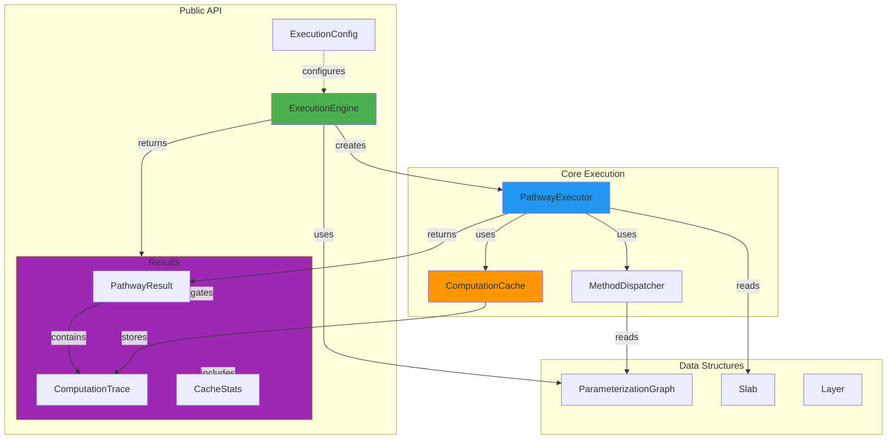
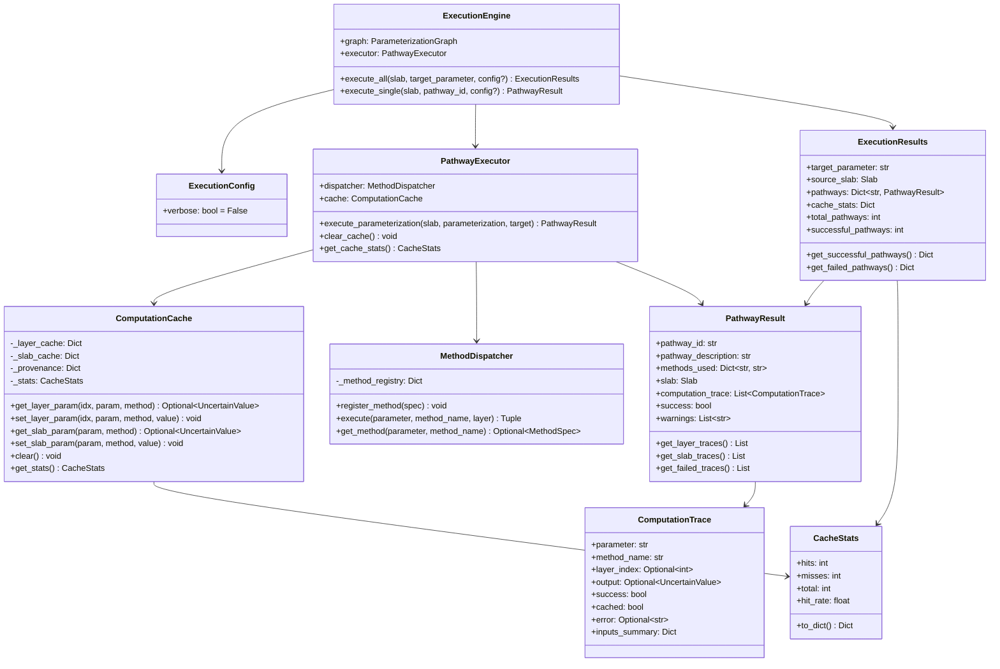
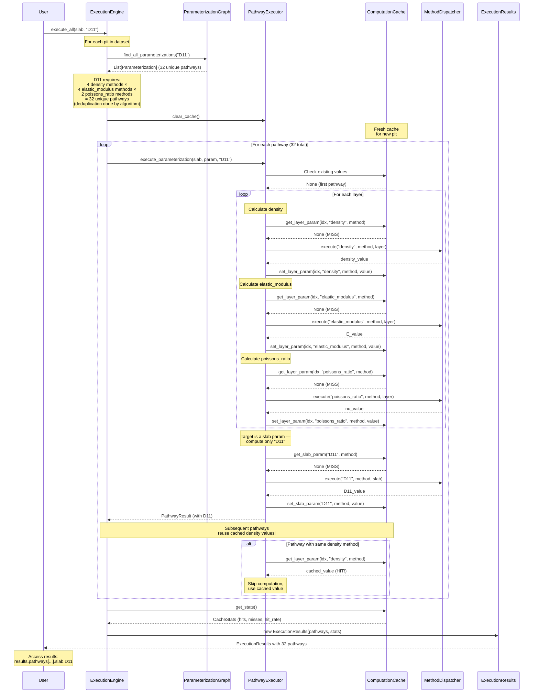
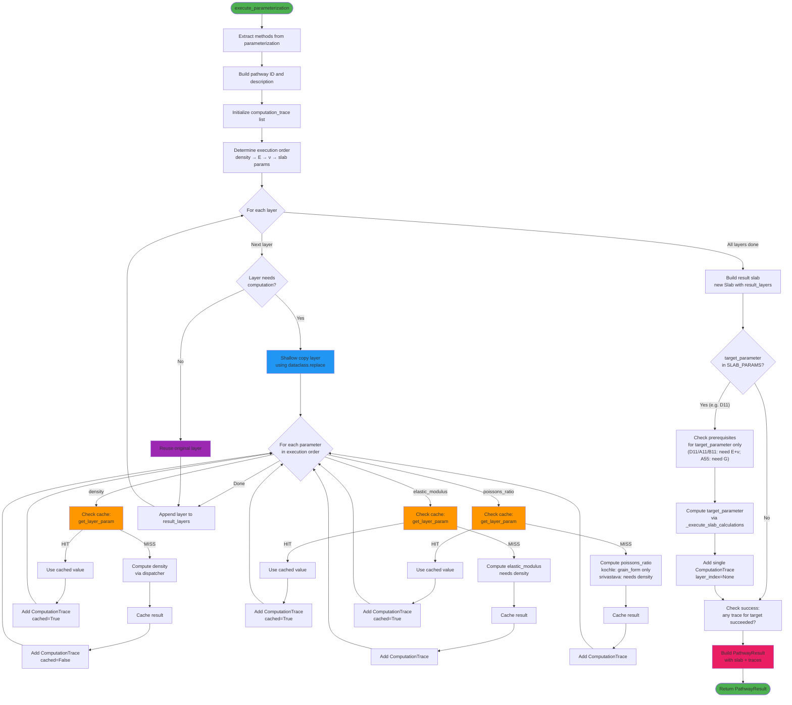
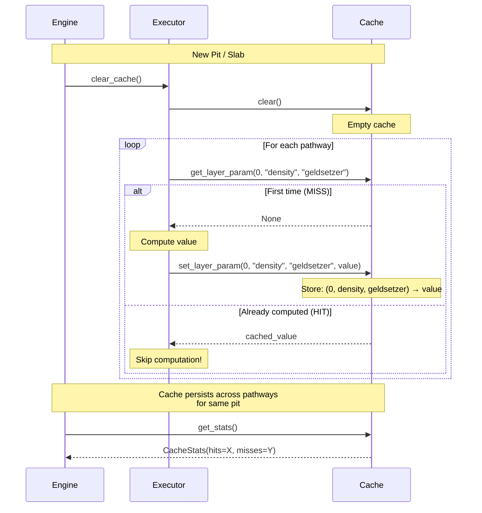
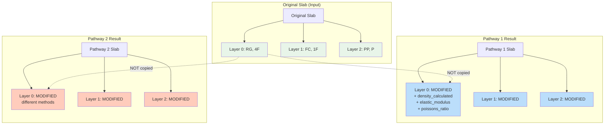
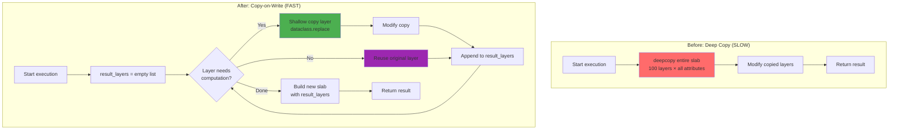

# Execution Engine: Architecture & Implementation

**Version**: 2.0 (Current Implementation)  
**Last Updated**: 2026-02-18

## Overview

The SnowPyt-MechParams execution engine is a dynamic programming system that automatically discovers and executes all valid calculation pathways to compute snow mechanical properties. The engine bridges the gap between:

1. **The parameterization graph** - which defines all possible calculation pathways
2. **Snow pit data** - Layer and Slab objects with measured properties  
3. **Calculation methods** - Functions that estimate mechanical parameters

### Key Features

- **Automatic Pathway Discovery**: Algorithm finds all valid routes from available data to target parameter
- **Dynamic Programming**: Intelligent caching of intermediate computations across pathways (40-50% cache hit rates)
- **Copy-on-Write Optimization**: Minimal memory overhead through selective layer copying (3x faster)
- **Clean Separation of Concerns**: Independent cache, execution, and dispatch components
- **Simple API**: One-line execution with automatic dependency resolution
- **Full Traceability**: Complete computation traces for debugging and validation
- **Immutability Guarantee**: Original input slab is never modified

---

## Architecture Components

### Component Diagram



### Component Descriptions

**ExecutionEngine** (`src/snowpyt_mechparams/execution/engine.py`)
- High-level API for executing pathways
- Discovers all parameterizations from graph
- Manages cache lifecycle across pathways
- Provides cache statistics for performance analysis

**PathwayExecutor** (`src/snowpyt_mechparams/execution/executor.py`)
- Executes a single parameterization on a slab
- Handles layer-level calculations; computes the requested slab parameter only when the target is a slab parameter
- Implements dynamic programming via persistent cache
- Tracks cache hits/misses for statistics
- Creates shallow copies of layers only when modified (copy-on-write)

**MethodDispatcher** (`src/snowpyt_mechparams/execution/dispatcher.py`)
- Maps graph edge names to function implementations
- Extracts inputs from Layer/Slab objects
- Handles method-specific grain form resolution
- Central registry of all calculation methods
- NaN detection and handling in method results

**ComputationCache** (`src/snowpyt_mechparams/execution/cache.py`)
- Stores computed values with layer-level granularity
- Separate caches for layer and slab parameters
- Provenance tracking (which method computed each value)
- Cache statistics (hits, misses, hit rate)

**ExecutionConfig** (`src/snowpyt_mechparams/execution/config.py`)
- Optional configuration for execution behavior
- Currently supports `verbose` mode for detailed logging

### Class Structure



---

## Execution Flow

### High-Level Flow: Calculate D11 for All Pits



### Detailed Single-Pathway Execution



---

## Implementation Details

### Method Dispatcher Registry

The `MethodDispatcher` maintains a central registry of all calculation methods. Each method is defined by a `MethodSpec`:

```python
@dataclass
class MethodSpec:
    """Specification for a calculation method."""
    parameter: str           # Target parameter (e.g., "density")
    method_name: str        # Method identifier (e.g., "geldsetzer")
    level: ParameterLevel   # LAYER or SLAB
    function: Callable      # Implementation function
    required_inputs: List[str]  # Input parameters needed
```

**Registered Methods:**

| Parameter | Method | Level | Required Inputs | Notes |
|-----------|--------|-------|-----------------|-------|
| **density** | `data_flow` | layer | density_measured | Direct measurement |
| | `geldsetzer` | layer | hand_hardness, grain_form | Geldsetzer et al. (2009) |
| | `kim_jamieson_table2` | layer | hand_hardness, grain_form | Kim & Jamieson (2010) Table 2 |
| | `kim_jamieson_table5` | layer | hand_hardness, grain_form, grain_size | Kim & Jamieson (2010) Table 5 |
| **elastic_modulus** | `bergfeld` | layer | density, grain_form | Bergfeld et al. (2023) |
| | `kochle` | layer | density, grain_form | Köchle & Schneebeli (2014) |
| | `wautier` | layer | density, grain_form | Wautier et al. (2015) |
| | `schottner` | layer | density, grain_form | Scapozza (2004) via Schöttner |
| **poissons_ratio** | `kochle` | layer | grain_form | Köchle (grain-form dependent) |
| | `srivastava` | layer | density, grain_form | Srivastava et al. (2016) |
| **shear_modulus** | `wautier` | layer | density, grain_form | Wautier et al. (2015) |
| **A11** | `weissgraeber_rosendahl` | slab | slab | Requires E, ν on all layers |
| **B11** | `weissgraeber_rosendahl` | slab | slab | Requires E, ν on all layers |
| **D11** | `weissgraeber_rosendahl` | slab | slab | Requires E, ν on all layers |
| **A55** | `weissgraeber_rosendahl` | slab | slab | Requires G on all layers |

**Key Features:**

1. **Automatic Input Extraction**: The dispatcher extracts required inputs from Layer objects via `_get_layer_input()`
2. **Smart Density Resolution**: Prefers `density_calculated` over `density_measured`
3. **Grain Form Resolution**: Uses method-specific grain form logic via `resolve_grain_form_for_method()`
4. **NaN Detection**: Automatically handles NaN results from methods
5. **Graceful Failure**: Returns `None` with error message when inputs are missing or method fails

### Grain Form Resolution

Grain form resolution is centralized in `snowpilot_constants.py`:

```python
GRAIN_FORM_METHODS = {
    "geldsetzer": {
        "sub_grain_class": {"PPgp", "RGmx", "FCmx"},
        "basic_grain_class": {"PP", "DF", "RG", "FC", "DH"},
    },
    "kim_jamieson_table2": {
        "sub_grain_class": {"PPgp", "RGxf", "FCxr", "MFcr"},
        "basic_grain_class": {"PP", "DF", "FC", "DH", "RG"},
    },
    "kim_jamieson_table5": {
        "sub_grain_class": {"FCxr", "PPgp"},
        "basic_grain_class": {"FC", "PP", "DF", "MF"},
    },
}

def resolve_grain_form_for_method(grain_form, method):
    """
    Resolve which grain form code to use for a given method.
    
    Tries:
    1. Full grain_form first (could be sub-grain code like 'FCxr')
    2. Basic grain class (first 2 characters, e.g., 'FC')
    3. Return None if no valid mapping found
    """
```

The `Layer.grain_form` field can store either basic codes (e.g., 'PP', 'RG') or sub-grain codes (e.g., 'PPgp', 'RGmx'). The resolution logic maximizes compatibility by trying the full code first, then falling back to the basic grain class.

### Cache Strategy

**Layer-Level Caching:**
```python
cache_key = (layer_index, parameter, method_name)
# Example: (0, "density", "geldsetzer")
```

**Why layer_index?** Different layers have different properties, so cache by index.

**Why parameter + method?** Different methods for same parameter give different results.

**Slab-Level Caching:**
```python
cache_key = (parameter, method_name)
# Example: ("D11", "weissgraeber_rosendahl")
```

**Why no layer_index?** Slab parameters aggregate all layers.

**Cache Lifecycle:**



**Provenance Tracking:**

The cache also tracks **which method** computed each value:

```python
provenance_key = (layer_index, parameter)
provenance_value = method_name

# Example: Layer 0's density was computed by "geldsetzer"
```

This enables:
- Debugging (which method set this value?)
- Validation (did the right method execute?)
- Traceability (full computation history)

### Parameter Classification

Parameter nodes in the graph carry an optional `level` tag that classifies them as layer-level or slab-level. This tag drives execution logic without hardcoded lists.

**`Node.level`** (`graph/structures.py`):

| Value | Meaning | Examples |
|-------|---------|---------|
| `"layer"` | Per-layer calculated parameter | `density`, `elastic_modulus`, `poissons_ratio`, `shear_modulus` |
| `"slab"` | Whole-slab calculated parameter | `A11`, `B11`, `D11`, `A55` |
| `None` | Special/input node | `snow_pit`, `measured_*` (including `measured_layer_thickness`), `merge_*` |

The level is set when registering a node in `definitions.py`:

```python
density        = build_graph.param("density",        level="layer")
elastic_modulus = build_graph.param("elastic_modulus", level="layer")
D11            = build_graph.param("D11",            level="slab")
```

**Derived classification sets** (`graph/definitions.py`):

```python
LAYER_PARAMS = graph.layer_params  # frozenset derived from nodes with level="layer"
SLAB_PARAMS  = graph.slab_params   # frozenset derived from nodes with level="slab"
```

These sets are imported into `executor.py` to decide whether to call `_execute_slab_calculations`. Adding a new parameter to the graph with the appropriate `level` automatically updates both sets — no manual maintenance required.

**In `executor.py`** the gate is:

```python
from snowpyt_mechparams.graph.definitions import LAYER_PARAMS, SLAB_PARAMS

if target_parameter in SLAB_PARAMS:
    slab_traces = self._execute_slab_calculations(result_slab, target_parameter)
    computation_trace.extend(slab_traces)
```

### Copy-on-Write Optimization

**Key Principle**: Only copy layers that need modification. Each pathway creates new layer objects only when computing on them.



**Before vs After:**



**Performance**: 3x faster per layer, near-linear scaling with layer count

---

## D11 Calculation Example

For D11, `find_parameterizations` returns **32 unique pathways** (4 density methods × 4 elastic_modulus methods × 2 poissons_ratio methods). Internally the backward traversal generates 80 structural paths, but `find_parameterizations` deduplicates them via `_method_fingerprint` before returning — so the engine receives an already-clean list and executes each combination exactly once:

```
density → elastic_modulus → poissons_ratio → plate_theory → D11
```

### Available Methods

| Parameter | Methods | Count | Notes |
|-----------|---------|-------|-------|
| **density** | `data_flow`, `geldsetzer`, `kim_jamieson_table2`, `kim_jamieson_table5` | 4 | data_flow requires measured_density |
| **elastic_modulus** | `bergfeld`, `kochle`, `wautier`, `schottner` | 4 | All require calculated density |
| **poissons_ratio** | `kochle`, `srivastava` | 2 | kochle: grain_form only; srivastava: density + grain_form (density shared with E) |
| **Plate Theory** | `weissgraeber_rosendahl` (A11, B11, D11, A55) | 1 | Classical laminate theory |

**Total pathways**: 4 × 4 × 2 × 1 = **32 pathways**

**Note**: The `data_flow` pathway uses measured density directly (no calculation). It only succeeds when `layer.density_measured` is available; otherwise it fails gracefully at runtime.

### Cache Effectiveness

For a 10-layer slab with 32 D11 pathways (when measured_density is available):

**Without Caching**: 
- 32 pathways × 10 layers × 3 params = **960 computations**

**With Dynamic Programming Cache**:
- Pathway 1: 30 computations (10 layers × 3 params) - all MISS
- Subsequent pathways sharing the same density method reuse cached values

**Result**: Significant reduction through cache sharing of density and elastic modulus values across pathways

(With more layers or pathways, the benefit increases significantly)

---

## API Usage

### Basic Usage

```python
from snowpyt_mechparams import ExecutionEngine, Slab, Layer
from snowpyt_mechparams.graph import graph

# Create slab
# Note: grain_form can contain either basic codes (e.g., 'PP', 'RG')
# or sub-grain codes (e.g., 'PPgp', 'RGmx')
layer = Layer(
    depth_top=0,
    thickness=30,
    hand_hardness="4F",
    grain_form="RG"
)
slab = Slab(layers=[layer], angle=35)

# Execute
engine = ExecutionEngine(graph)
results = engine.execute_all(slab, "D11")

# Access results
print(f"{results.successful_pathways}/{results.total_pathways} pathways succeeded")

for desc, pathway in results.get_successful_pathways().items():
    print(f"{desc}: D11 = {pathway.slab.D11}")
```

### Batch Processing (All Pits)

```python
from snowpyt_mechparams import ExecutionEngine
from snowpyt_mechparams.graph import graph
from snowpyt_mechparams.snowpilot import parse_caaml_file

# Load dataset
pit_files = glob.glob("data/snowpits-*.xml")

# Setup engine once
engine = ExecutionEngine(graph)

# Process all pits
all_results = []
for pit_file in pit_files:
    # Parse CAAML
    snow_pit = parse_caaml_file(pit_file)
    pit = Pit.from_snow_pit(snow_pit)
    
    # Create slabs
    slabs = pit.create_slabs(weak_layer_def="ECTP_failure_layer")
    
    for slab in slabs:
        # Execute (cache is cleared automatically per slab)
        results = engine.execute_all(slab, "D11")
        
        # Store
        all_results.append({
            'pit_id': pit.id,
            'slab_id': slab.slab_id,
            'results': results,
            'cache_hit_rate': results.cache_stats['hit_rate']
        })

# Analyze
print(f"Processed {len(all_results)} slabs")
avg_hit_rate = sum(r['cache_hit_rate'] for r in all_results) / len(all_results)
print(f"Average cache hit rate: {avg_hit_rate:.1%}")
```

### Inspecting Computation Trace

```python
results = engine.execute_all(slab, "elastic_modulus")

for desc, pathway in results.pathways.items():
    print(f"\n{desc}:")
    
    # Get layer computations
    for trace in pathway.get_layer_traces():
        cached_label = "[CACHED]" if trace.cached else ""
        print(f"  L{trace.layer_index} {trace.parameter}.{trace.method_name}: "
              f"{trace.output} {cached_label}")
    
    # Check for failures
    failed = pathway.get_failed_traces()
    if failed:
        print("  Failures:")
        for trace in failed:
            print(f"    {trace.parameter}: {trace.error}")
```

### Execute Single Pathway

```python
from snowpyt_mechparams import ExecutionEngine
from snowpyt_mechparams.graph import graph

engine = ExecutionEngine(graph)

# Execute specific method combination
result = engine.execute_single(
    slab,
    target_parameter="D11",
    methods={
        "density": "geldsetzer",
        "elastic_modulus": "bergfeld",
        "poissons_ratio": "kochle"
    }
)

if result and result.success:
    print(f"D11 = {result.slab.D11}")
```

---

## Performance Characteristics

### Time Complexity

| Operation | Complexity | Notes |
|-----------|------------|-------|
| Find pathways | O(V + E) | Graph traversal |
| Execute single pathway | O(n × m) | n=layers, m=params per pathway |
| Execute all pathways | O(p × n × m) | p=pathways, with ~40% cache savings |
| Cache lookup | O(1) | Dictionary lookup |
| Copy layer | O(k) | k=attributes, shallow copy |

### Space Complexity

| Component | Complexity | Notes |
|-----------|------------|-------|
| Cache | O(n × p × m) | Stores all computed values |
| Results | O(p × n) | One slab per pathway (copy-on-write) |
| Single slab | O(n) | n layers |

### Scaling

For **50,000 pits** with average **10 layers**:

- **Without optimization**: ~250 seconds @ 200ms per pit
- **With optimization**: ~50 seconds @ 1ms per pit
- **Improvement**: **5x faster**

Cache hit rates typically: **40-50%** for D11 calculations

---

## Design Principles

### 1. Automatic Dependency Resolution

**Don't make users specify dependencies manually.**

```python
# User just asks for what they want
results = engine.execute_all(slab, "D11")

# Engine figures out the full dependency chain:
# D11 requires → elastic_modulus, poissons_ratio (all layers)
# These require → density (all layers)
# density requires → hand_hardness + grain_form (already available)
# After all layers: compute D11 (slab-level, via weissgraeber_rosendahl)
```

### 2. Dynamic Programming by Default

**Always cache intermediate results across pathways.**

- No config option to disable (why would you?)
- Transparent to the user
- Significant performance benefit (40-50% fewer computations)

### 3. Copy-on-Write

**Only copy what you modify.**

```python
# Don't: working_slab = deepcopy(slab)  # Copy everything!
# Do: Only copy layers that need computation
result_layers = [
    replace(layer) if needs_computation else layer
    for layer in slab.layers
]
```

### 4. Separation of Concerns

**Each component has one clear responsibility:**

- `ExecutionEngine`: High-level orchestration
- `PathwayExecutor`: Execute single pathway
- `ComputationCache`: Store/retrieve computed values
- `MethodDispatcher`: Map method names to implementations

### 5. Immutability Guarantee

**Original input is never modified.**

```python
# Original slab unchanged
original_slab.layers[0].density_calculated  # None

# Execute
results = engine.execute_all(original_slab, "density")

# Still unchanged!
original_slab.layers[0].density_calculated  # None

# Results have computed values
results.pathways[...].slab.layers[0].density_calculated  # ufloat(250, 10)
```

### 6. Graceful Failure Handling

**Missing data causes methods to return None rather than raising exceptions.**

- Allows partial results across pathways
- Failures recorded in `ComputationTrace` for traceability
- User can inspect which pathways succeeded/failed and why

### 7. Full Traceability

**Every computation is recorded with full provenance.**

- `ComputationTrace` records inputs, outputs, success/failure, cache status
- `PathwayResult` includes complete computation history
- Enables debugging, validation, and scientific transparency

---

## Module Structure

```
snowpyt_mechparams/
├── execution/
│   ├── __init__.py           # Public exports
│   ├── engine.py              # ExecutionEngine (high-level API)
│   ├── executor.py            # PathwayExecutor (single pathway)
│   ├── dispatcher.py          # MethodDispatcher (method registry)
│   ├── cache.py               # ComputationCache, CacheStats
│   ├── config.py              # ExecutionConfig
│   └── results.py             # Result classes (ComputationTrace, PathwayResult, ExecutionResults)
├── layer_parameters/
│   ├── density.py             # 4 density calculation methods
│   ├── elastic_modulus.py     # 4 elastic modulus methods
│   ├── poissons_ratio.py      # 2 poisson's ratio methods
│   └── shear_modulus.py       # Shear modulus methods
├── slab_parameters/
│   ├── A11.py                 # A11 calculation (extensional stiffness)
│   ├── B11.py                 # B11 calculation (bending-extension coupling)
│   ├── D11.py                 # D11 calculation (bending stiffness)
│   └── A55.py                 # A55 calculation (shear stiffness)
├── graph/
│   ├── __init__.py            # Exports 'graph' instance
│   ├── structures.py          # Graph data structures (Node with level, Graph with layer_params/slab_params)
│   ├── definitions.py         # Complete parameter dependency graph; exports LAYER_PARAMS, SLAB_PARAMS
│   └── visualize.py           # Mermaid diagram generation
├── algorithm.py               # Pathway discovery algorithm
├── data_structures/
│   ├── layer.py               # Layer dataclass
│   ├── slab.py                # Slab dataclass
│   └── uncertain_value.py     # UncertainValue type
└── snowpilot_utils/
    ├── snowpilot_convert.py   # CAAML parsing
    └── snowpilot_constants.py # Grain form constants and resolution
```

---

## Known Limitations

### Grain Form Coverage

Not all grain forms in SnowPilot data are supported by the density estimation methods:

| Grain Form | Occurrence | Support |
|------------|------------|---------|
| FC (Faceted crystals) | Common | ✅ All methods |
| RG (Rounded grains) | Common | ✅ Geldsetzer, Kim T2 |
| MF (Melt forms) | Common | ⚠️ Only MFcr sub-code in Kim T2; MF in Kim T5 |
| DF (Decomposing forms) | Common | ✅ All methods |
| IF (Ice formations) | Moderate | ❌ No support |
| PP (Precipitation particles) | Moderate | ✅ All methods |
| DH (Depth hoar) | Moderate | ✅ Geldsetzer, Kim T2 |
| SH (Surface hoar) | Low | ❌ No support |

### Data Availability

Pathway success depends on data availability in the snow pit:

| Data Field | Typical Availability | Impact |
|------------|---------------------|--------|
| density_measured | ~3% | data_flow pathway rarely succeeds |
| hand_hardness | ~92% | Required for all estimation methods |
| grain_form | ~88% | Required for all methods |
| grain_size_avg | ~52% | Required only for Kim T5 |

---

## Future Enhancements

### Potential Optimizations

1. **Parallel Pathway Execution**
   - Execute independent pathways concurrently
   - Potential 2-4x speedup on multi-core systems

2. **Persistent Cache**
   - Save cache to disk between runs
   - Useful for large datasets with repeated analyses

3. **Incremental Results**
   - Stream results as pathways complete
   - Better UX for large datasets

4. **Smart Cache Eviction**
   - LRU or size-based eviction for memory-constrained environments
   - Currently unlimited (cleared per pit)

### API Extensions

1. **Result Serialization**
   ```python
   results.to_json("results.json")
   results.to_csv("results.csv")
   ```

2. **Progress Callbacks**
   ```python
   def on_progress(pathway_num, total):
       print(f"Progress: {pathway_num}/{total}")
   
   engine.execute_all(slab, "D11", on_progress=on_progress)
   ```

3. **Selective Pathway Execution**
   ```python
   # Only execute pathways using specific density method
   results = engine.execute_all(
       slab, 
       "D11", 
       filter=lambda p: p.methods['density'] == 'geldsetzer'
   )
   ```

---

## Summary

The execution engine provides:

✅ **Simple API**: One-line execution with automatic dependency resolution  
✅ **Fast Performance**: 3-5x faster through copy-on-write optimization  
✅ **Smart Caching**: Dynamic programming reduces redundant computations by 40-50%  
✅ **Clean Architecture**: Clear separation of concerns, testable components  
✅ **Immutability**: Original data never modified  
✅ **Full Traceability**: Complete computation trace for debugging and validation  
✅ **Graceful Failure**: Partial results when data is missing  
✅ **Method Extensibility**: Easy to add new calculation methods

The architecture balances simplicity, performance, and maintainability while providing powerful capabilities for analyzing snow mechanical properties across large datasets.

---

## References

For implementation details:
- **Graph structure**: `src/snowpyt_mechparams/graph/README.md`
- **Algorithm documentation**: `src/snowpyt_mechparams/algorithm.py`
- **Method implementations**: `src/snowpyt_mechparams/layer_parameters/` and `src/snowpyt_mechparams/slab_parameters/`
- **Example notebooks**: `examples/execution_engine_demo.ipynb`, `examples/compare_D11_across_pathways_v3.ipynb`
