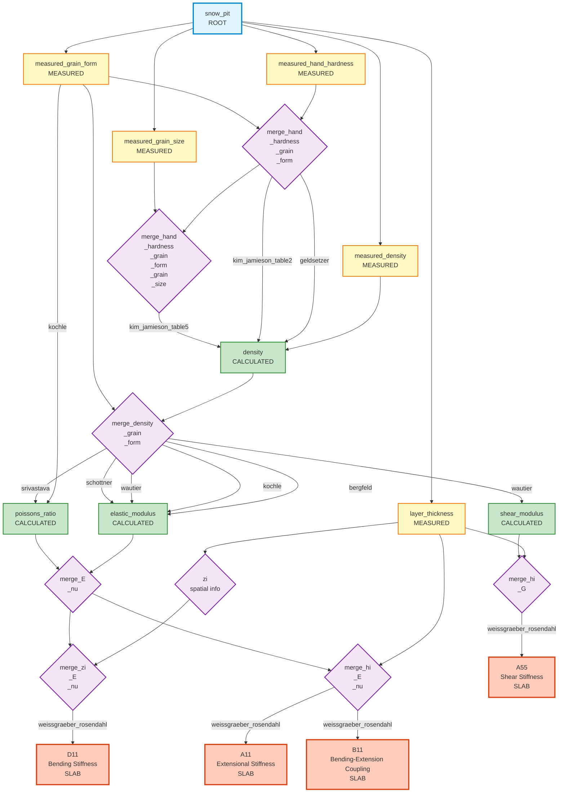

# SnowPyt-MechParams Parameter Dependency Graph

```mermaid
graph TB
    %% Root node
    snow_pit[snow_pit<br/>ROOT]
    
    %% Measured parameter nodes
    measured_density[measured_density<br/>MEASURED]
    measured_hand_hardness[measured_hand_hardness<br/>MEASURED]
    measured_grain_form[measured_grain_form<br/>MEASURED]
    measured_grain_size[measured_grain_size<br/>MEASURED]
    layer_thickness[layer_thickness<br/>MEASURED]
    
    %% Layer-level merge nodes
    merge_hand_hardness_grain_form{merge_hand<br/>_hardness<br/>_grain<br/>_form}
    merge_hand_hardness_grain_form_grain_size{merge_hand<br/>_hardness<br/>_grain<br/>_form<br/>_grain<br/>_size}
    merge_density_grain_form{merge_density<br/>_grain<br/>_form}
    
    %% Calculated layer parameters
    density[density<br/>CALCULATED]
    elastic_modulus[elastic_modulus<br/>CALCULATED]
    poissons_ratio[poissons_ratio<br/>CALCULATED]
    shear_modulus[shear_modulus<br/>CALCULATED]
    
    %% Slab-level merge nodes
    zi{zi<br/>spatial info}
    merge_E_nu{merge_E<br/>_nu}
    merge_zi_E_nu{merge_zi<br/>_E<br/>_nu}
    merge_hi_G{merge_hi<br/>_G}
    merge_hi_E_nu{merge_hi<br/>_E<br/>_nu}
    
    %% Slab parameters
    A11[A11<br/>Extensional Stiffness<br/>SLAB]
    B11[B11<br/>Bending-Extension Coupling<br/>SLAB]
    D11[D11<br/>Bending Stiffness<br/>SLAB]
    A55[A55<br/>Shear Stiffness<br/>SLAB]
    
    %% Snow pit to measured parameters (data flow)
    snow_pit --> measured_density
    snow_pit --> measured_hand_hardness
    snow_pit --> measured_grain_form
    snow_pit --> measured_grain_size
    snow_pit --> layer_thickness
    
    %% Density pathways
    measured_density --> density
    merge_hand_hardness_grain_form -->|geldsetzer| density
    merge_hand_hardness_grain_form -->|kim_jamieson_table2| density
    merge_hand_hardness_grain_form_grain_size -->|kim_jamieson_table5| density
    measured_hand_hardness --> merge_hand_hardness_grain_form
    measured_grain_form --> merge_hand_hardness_grain_form
    merge_hand_hardness_grain_form --> merge_hand_hardness_grain_form_grain_size
    measured_grain_size --> merge_hand_hardness_grain_form_grain_size
    
    %% Elastic modulus pathways
    density --> merge_density_grain_form
    measured_grain_form --> merge_density_grain_form
    merge_density_grain_form -->|bergfeld| elastic_modulus
    merge_density_grain_form -->|kochle| elastic_modulus
    merge_density_grain_form -->|wautier| elastic_modulus
    merge_density_grain_form -->|schottner| elastic_modulus
    
    %% Poisson's ratio pathways
    measured_grain_form -->|kochle| poissons_ratio
    merge_density_grain_form -->|srivastava| poissons_ratio
    
    %% Shear modulus pathways
    merge_density_grain_form -->|wautier| shear_modulus
    
    %% Slab-level calculations
    layer_thickness --> zi
    elastic_modulus --> merge_E_nu
    poissons_ratio --> merge_E_nu
    zi --> merge_zi_E_nu
    merge_E_nu --> merge_zi_E_nu
    layer_thickness --> merge_hi_G
    shear_modulus --> merge_hi_G
    layer_thickness --> merge_hi_E_nu
    merge_E_nu --> merge_hi_E_nu
    merge_zi_E_nu -->|weissgraeber_rosendahl| D11
    merge_hi_G -->|weissgraeber_rosendahl| A55
    merge_hi_E_nu -->|weissgraeber_rosendahl| A11
    merge_hi_E_nu -->|weissgraeber_rosendahl| B11
    
    %% Styling
    classDef rootNode fill:#e1f5ff,stroke:#0288d1,stroke-width:3px
    classDef measuredNode fill:#fff9c4,stroke:#f57f17,stroke-width:2px
    classDef mergeNode fill:#f3e5f5,stroke:#7b1fa2,stroke-width:2px
    classDef layerCalc fill:#c8e6c9,stroke:#388e3c,stroke-width:2px
    classDef slabCalc fill:#ffccbc,stroke:#d84315,stroke-width:3px
    
    class snow_pit rootNode
    class measured_density,measured_hand_hardness,measured_grain_form,measured_grain_size,layer_thickness measuredNode
    class merge_hand_hardness_grain_form,merge_hand_hardness_grain_form_grain_size,merge_density_grain_form,zi,merge_E_nu,merge_zi_E_nu,merge_hi_G,merge_hi_E_nu mergeNode
    class density,elastic_modulus,poissons_ratio,shear_modulus layerCalc
    class A11,B11,D11,A55 slabCalc
```
